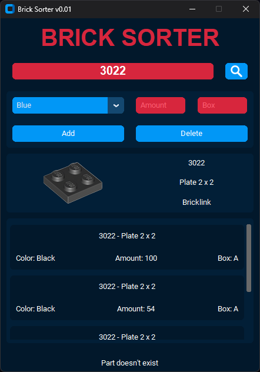

## **Brick Sorter**
This is a desktop application called Brick Sorter that allows you to search for LEGO
parts and manage your LEGO collection.
I have developed it to sort my personal LEGO collection

## **Features**
- Rebrickable.com API to fetch information about LEGO parts 
- SQLite database integration for parts collection
- customtkinter integration for modern UI

## **Installation**
1. Use the .exe file - (future feature):   
    - link
2. Download source code:
    - install requirements: `pip install -r requirements.txt`
    - create **api.txt** with your own API key—get a free one at: https://rebrickable.com
    - place **api.txt** in the **keys** folder in the project root
    - run `python brick_sorter.py`

    
## **Usage**

1.  Launch the Brick Sorter app.
2.  Enter a LEGO part number in the search field and press Enter or click the Search button.
3.  The app will display the part's image, number, name, and a link to its page on BrickLink.
4.  If the part is already in your catalog, the associated information will be displayed.
5.  To add the part to your catalog, enter all relevant information and click the Add button.
6.  To delete a part from your catalog, search for the part, select it and then click the Delete button.

## **License**

This project is licensed under the [MIT License](./LICENSE).